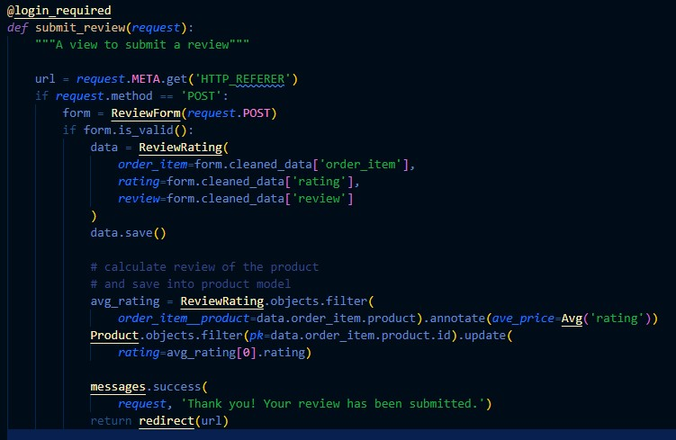

# SHOES SHOP
> This project is an e-commerce website created to advert and sell shoes but only for learning purposes at the moment, so no commercial or business benefits are taken, in future with some changes this project could become potentially a real E-commerce website, implementing a real stripe Api for payments for example.(The Stripe functionality for payment implemented is in testing mode but it has the same functionality). 
The user can easily register and use the platform to buy shoes (using testing mode), create his own favourite wish list and give also a feedback to the seller after registration using the review and rating product form. 

The user receive also a confirmation email after registering for the first time, and after submitting any order request, this functionality is working using the Gmail email account settings, generatig a password for the app. 
The project has been develop in Gitpod and deployed in Heroku using also the S3 AWS Amazon free service to store the photos in a bucket for better performance and user experience. 

### User Stories

* The user can choose from 5 different categories of shoes: Men, Women, Kids, boy, girl and can easily buy any item available using the stripe payment gateway system in testing mode so not real payments. 
* I did not complete fully still all the categoties with the relevant items, for example the girl category still does not have any shoes available but I am planning to add more soon  
* The user can create his own favourite item list using the Wishlist model created 
* The user can also review and give a rating score for any product bought, please see below for better explanation of user stories. 
* The project is designed to be compatible with all devices, from computer to mobile and Highpads. 


## Table of Contents
* [Technologies](#technologies)
* [Features](#features)
* [Database](#database)
* [Testing](#testing)


## Technologies
### Languages
* [HTML5](#https://en.wikipedia.org/wiki/HTML5)
* [CSS3](#https://en.wikipedia.org/wiki/CSS)
* [JavaScript](#https://en.wikipedia.org/wiki/JavaScript)
* [Python3](#https://www.python.org/)
* [Balsamiq Wireframes] used for the project draft 
* [Python] validator (#http://pep8online.com/) very helpful to chech the identation
* [CSS3] validator (#https://jigsaw.w3.org/css-validator/)
* [Javascript] validator (#https://jshint.com/)
* [w3schools] was used as a general source of knowledge
* [Google Chrome Developer Tool] this built-in developer tool was used to inspect page elements and help debug issues
* [Stackoverflow] was used as a general source of knowledge (#https://stackoverflow.com/)
* [Json Formatter] was used as json file formatter and validator


### Frameworks and Libraries
* [Django](#https://www.djangoproject.com/)
* [Pip3](#https://pip.pypa.io/en/stable/)
* [jQuery](#https://jquery.com/)
* [FontAwesome](#https://fontawesome.com/)
* [Bootstrap](#https://getbootstrap.com/)

### Others
* [Heroku](#https://id.heroku.com/login) used to deploy live site. The live app is (#https://shoes-shop1985.herokuapp.com/)
* [Stripe](#https://stripe.com/en-ie) used for the payments system, this software offers payment processing software and application programming interfaces for e-commerce websites and mobile applications
* [AWS](#https://aws.amazon.com/) used for file storage.
* [GitHub](#https://github.com/) used to host repository. The project repository ling is (#https://github.com/Iacopo454/Shoes-shop/)
* [GitPod](#https://www.gitpod.io/) used to develop project and organise version control.

### Scope
* Clean User Experience by using technologies mentioned in the introduction - HTML, CSS, JavaScript, Python + Django, Stripe, Heroku
* Easy and intuitive navigation via the navbar with dropdown categories of products 
* Interactive features for the users: buy button, wishlist, review, bag, account with profile, checkout and information about each product, like description, rating, price, image
* Wishlist for creating favorite products list in and the possibility to give review for a product bought 
* Secure log out feature to store data safely registering, sign in and loggin out
* Footer with social media icons to link to Facebook, Instagram and Twitter


### Credits
* Photos:
All taken from https://shoppremiumoutlets.com/ (as mention the website it is not used for commectical purposes but only learning and educational)
* Code: 
Code inspiration for the whole project and code snippets for the fundamental base structure borrowed from "Boutique Ado" the walkthrough project of Code Institute for the MS4 
* Code inspiration for Wishlist and Review model adapted after mentor sessions with my mentor Sandeep Aggarwal following similar implementation of the video-lesson in CI for creating models

* Website type and purpose:
The website is an E-commerce website for learning purposes only at the moment and following the requirements of the MS4 provided from Code institue.

## Features
### Wishlist page
One logged-in user can save his favourite products on his wishlist page.
On the wishlist page, the user can view:
- List of products of his favorite.
- By click remove button, one can remove the product from his wishlist.

#### How create a wishlist app
For wishlist functionality, I crate a separate `Wishlist` app. By `python3 manage.py startapp wishlist` is a script that will create the directories and files for wishlist. The directory structure which looks like this:

```
wishlist/
    __init__.py
    admin.py
    apps.py
    migrations/
        __init__.py
    models.py
    tests.py
    views.py
```
In the `settings.py` file, I need to add a refference of wishlist app in the `INSTALLED_APPS` settings.

```
INSTALLED_APPS = [
    ....,
    ....,
    'wishlist',
]
```

In the wishlist app, I have create a model: `UserWishlist` has a user, product, created_at fields. The user is associated with auth user model and the product is associated with product model.

wishlist/models.py
```
from django.db import models
from django.contrib.auth.models import User
from products.models import Product


class UserWishlist(models.Model):
    """
    A user wishlist model for storing user product wishlist
    """
    user = models.ForeignKey(User, on_delete=models.CASCADE)
    product = models.ForeignKey(Product, on_delete=models.CASCADE, related_name='wishlist_product')
    created_at = models.DateTimeField(auto_now_add=True)

    def __str__(self):
        return f"{self.user} - {self.product}"
```
In the `UserWishlist` model:
- `user` field that using `ForeignKey`. That tells Django the user field is related with auth user model.
- `product` field that also using `ForeignKey`. That tells Django the product field is related with Product model.
- `created_at` field datatype is `DateTImeField` for storing datetimes into the database. By `auto_now_add=True`, automatically set time when an user create a wishlist.

For creating migrations file in `wishlist/migrations`, I run another command:
```
python3 manage.py makemigrations wishlist
```

Now, run migrate again to create the userwishlist model tables in the database: 
```
python3 manage.py migrate
```

In `products/templates/products/product_details.html` file, I have added a icon for add wishlist for specific product.
```
<a href="" class="btn btn-lg mt-5 wishlist_btn" style="font-size: 2rem">
    <span class="icon">
        <i class="fas fa-heart"></i>
    </span>
</a>
```
When click on the icon, its call the `add_to_wishlist` function with product id parameter.
For urls, I have created `urls.py` file in wishlist app and added these new views:
```
from django.urls import path
from . import views

app_name = 'wishlist'

urlpatterns = [
    path('<int:product_id>/', views.add_to_wishlist, name='add_to_wishlist'),
]
```

In `wishlist/views.py`:
```
@login_required
def add_to_wishlist(request, product_id):
    """A view to add or remove from wishlist"""
       
    product = get_object_or_404(Product, id=product_id) 
    user_wishlist = product.wishlist_product.filter(user=request.user) 

    if user_wishlist.exists():
        user_wishlist.delete()
        msg = f"{product} has been removed from your WishList"
        messages.error(request, msg)
    else:        
        wishlist = UserWishlist(user=request.user, product=product)
        wishlist.save()  
        msg = f"Added {product} to your WishList"      
        messages.success(request, msg)

    return HttpResponseRedirect(request.META["HTTP_REFERER"])
```
In the views, the `@login_required` decorators indicates that only authenticated use can access the function. In this function, `get_object_or_404` checks the prodcut for the passes product_id exists or not in product table. If it exists in product table, then again checks in the userwishlist table that for the requsted user the product exists or not.
If in userwishlist the product id exists, then delete the row from table and pass a error message.
Otherwise, the product_id and requested user_id save into the UserWishlist model table and pass a success message.

By `HttpResponseRedirect` the function redirect to the `HTTP_REFERER` indicates value.

In `products/templates/products/product_details.html` file, I have added a condition that if the product already exists in the wishlist, it'll show the `<i class="fas fa-heart"></i>` icon, otherwise it'll show `<i class="far fa-heart"></i>`. The codes are lool like:
```
<a href="" class="btn btn-lg mt-5 wishlist_btn" style="font-size: 2rem">
    <span class="icon">
        
        <i class="fas fa-heart"></i>
        
        <i class="far fa-heart"></i>
        
    </span>
</a>
```
And in the `products/views.py`, I added some codes for checking product has in wishlist or not when shows the specific product details page and pass the value with context.
The `product_detail()` function, the extended codes are:
```
def product_detail(request, product_id):
    """ A view to show individual product details """

    product = get_object_or_404(Product, pk=product_id)

    # check the product for the requested user wishlist exists or not
    wishlist = False
    if request.user.is_authenticated:
        user_wishlist = product.wishlist_product.filter(user=request.user)
        if user_wishlist.exists():
            wishlist = True

    context = {
        'product': product,
        'categories': Category.objects.all(),
        'wishlist': wishlist,
    }

    return render(request, 'products/product_detail.html', context)
```

#### My Wishlist page
In the `templates/base.html`, I have added a menu "My wishlist" in the `Accounts` drowdown. The menu is responsible for showing the list of specific user favourite products. The extened codes are:
```
<a href="" class="dropdown-item">My Wishlist</a>
```

When user click on the menu, the wishlist index path() are call the views for showing list.
In wishlist/urls.py, I added another path:
```
urlpatterns = [
    path('', views.wishlist_view, name='index'),
    path('<int:product_id>/', views.add_to_wishlist, name='add_to_wishlist'),
]
```

In wishlist/views.py, the wishlist_view function has been added:
```
@login_required
def wishlist_view(request):
    """Show all product of wishlist for the requested user"""

    user_wishlist = UserWishlist.objects.filter(user=request.user)
    return render(request, "wishlist/user_wishlist.html", {
        "user_wishlist": user_wishlist, 
        "categories": Category.objects.all()
        })
```
In this code, `@login_required` indicates that only authenticated user can access the function.
For the request user, get all objects from `UserWishlist` model tables and pass with render function.
`Category.objects.all()` that gets all catgories from catgory tables for showing into the navbar.
The render function return into a template `wishlist/user_wishlist.html`.

In `wishlist/temlates/wishlist/user_wishlist.html`, if get the wishlist, it'll show the objects data by looping, otherwise it'll show `No products have been added to your wishlist yet`.
In this page, by clicking `Remove from Wishlist` button, user can delete the product for his wishlist.

For showing the wishlist model into the Django Administrator panel, need to register the userwishlist model in the admin file.
In `wishlist/admin.py`, the codes looks like:
```
from django.contrib import admin
from wishlist.models import UserWishlist

admin.site.register(UserWishlist)
```


### Orders page
On the orders page, the user can view the list of all his own orders.

### Order details page
On the order details page, the user can view:
- List all his purchased products for a specific order.
- Review form for feedback.

### Review
One user can give feedback and rate for a product of his purchased product.
The rating and feedback will be shown on the product details page.

When an user submit the review form, he need to rate the product by click on star icon and write the feedback in the text field.
For store the review for a specific product, the models fields are:
- order_item
- rating
- review
- created_at

When the user submits the review form, the form data is stored in the database, and same time for the specific product calculate the average rating that given by the users and save it into the product.


### Tutorials
- https://www.youtube.com/watch?v=YZvRrldjf1Y was used as a general source of knowledge.
- Code institute video lessons on how to build an E-commerce website using Django, Python, Javascript, Html and CSS.

## Database
Two relational databases were used to create this site - during development SQLite was used and then Postgres was used for the production on Heroku. Below is an image of ERD how the database models relate to each other:


## Testing
* The app has been tested on different devices and browser (Google Chrome, Safari, Mozilla and Internet Explorer) and it has not shown anymore issues or errors in the functionalities implemented. The devices used for testing are the following: 
a Macbook Air, an Highpone 8 and a Window computer. 
* Testcase testing has been used for all the models: Products, Checkout, Wishlist and Review to make sure are working properly. 

### Testing from user stories
#### As an unregistered, I want to 

  + *be able to browse through all products available.*

All users, regardless of registered/logged in status, can browse through all products, add to bag and make a purchase:


---

  + *have the ability browse through the categories on the site.*

All users, regardless of registered/logged in status, can browse through the listed categories:


---

  + *have the ability to show details of a specific product on the site.*

All users, regardless of registered/logged in status, can see the products details: 


---

  + *have the ability to see the reviews of a product details page.*

All users, regardless of registered/logged in status, can see the reviews of a specific product: 


---


#### As an registered user, I want to 

  + *be able to create wishlist of my favourite products.*

An authenticated user, can add their favourite products in their wishlist:


---

  + *have the ability browse through the 'My Wishlist' menu on the site.*

An authenticated user, can see his wishlists products:


---

  + *have the ability browse through the 'My Orders' menu on the site.*

An authenticated user, can see his all orders:


---

+ *have the ability to see specific orders details with purchased products through click on view button.*

An user, able to give feedback and rate the products from this page.


---

### Automated Testing
Automated Unit Testing was carried out with Django testing tools and written to cover as much of the site as possible.
In terminal, for automated testing need to run the command:
    `python3 manage.py test`

#### Wishlist App
- Models
  - test for storing wishlist products into the database

- Views
  - test that unauthorized users cannot see the wishlist page.
  - test that unauthorized users cannot add product in wishlist.
  - test a logged in user can see the wishlist page.
  - test for authenticated user can add product in wishlist and agian redirect to the product details page.


#### Review App
- Models
  - test for storing data for a review into the database

- Views
  - test that unauthorized users cannot see the orders list page.
  - test that unauthorized users cannot view specific order details.
  - test that unauthorized users cannot give any feedback. 
  - test a logged in user can see the orders list page.
  - test for authenticated user can view a specific order details.
  - test for authenticated user can give feedback and rate the purchese product. Then redirect at order details page.

- Forms
  - test that specific fields are required. Otherwise an invalid form retun False
  - test that a valid form return True


#### To clone the code from GitHub:
- On GitHub, navigate to the main page of the repository.
- Above the list of files, click Code:
- To clone the repository using HTTPS, click HTTPS under "Clone".
- Open Git Bash.
- Change the current working directory to the location where you want the cloned directory.
- Type git clone, and then paste the URL you copied earlier: $ git clone
* https://github.com/Iacopo454/Shoes-shop
- Press Enter to create your local clone.
- Create your own env.py file to store variables, and ensure this is listed in your .gitignore file to keep these from being displayed publicly

## To Deploy the project in Heroku:
* Create your account on Heroku here: https://signup.heroku.com/login
* Create a new app on heroku:
Go to: https://dashboard.heroku.com/apps select new, create new app from the dropdown menu on the right. Enter your app-name and region and click create app. Under deployment method, select github to activate automatic deployments from Git to Heroku. 

### Slack Community

* I resolved many issues encountered after searching on Slack in the Code Institute community.
* I managed to solve error using Google and checking with the Tutor support team of Code Institute 

## Acknowledgments
I would like to thank the tutor from Code Institute which tutor me and help me throught this project difficulties, my mentor which has been patient and the Slack commumnity which not only provide helps with active users but it is often helpful with answer to previous frequent questions from anyone part of this community.   