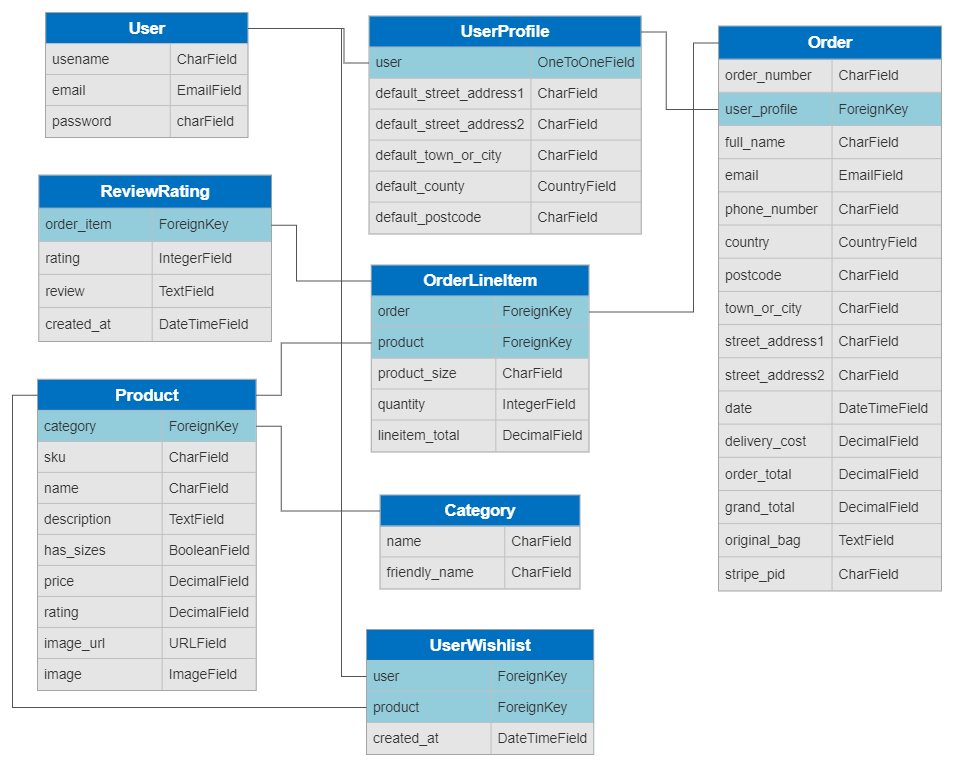
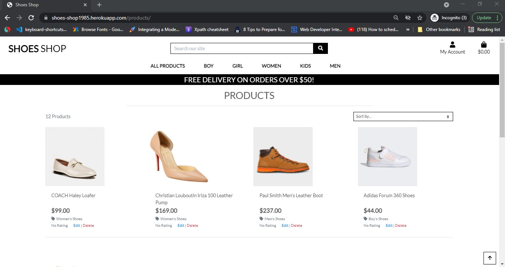
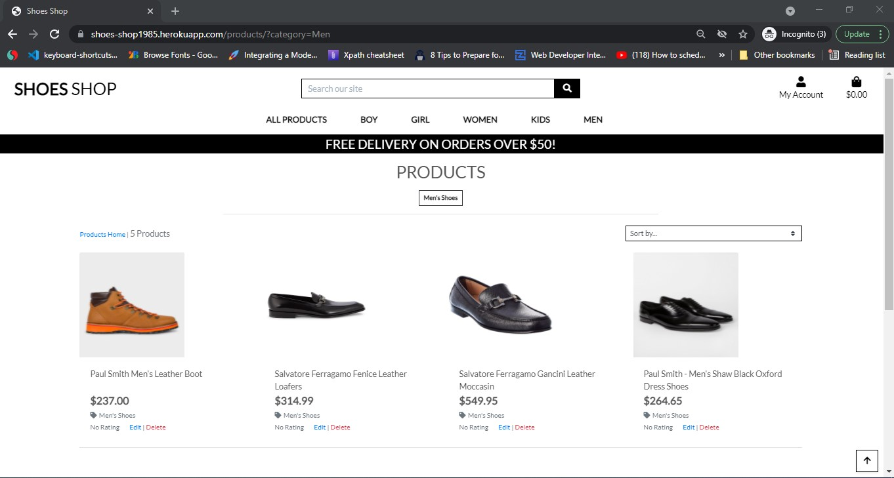
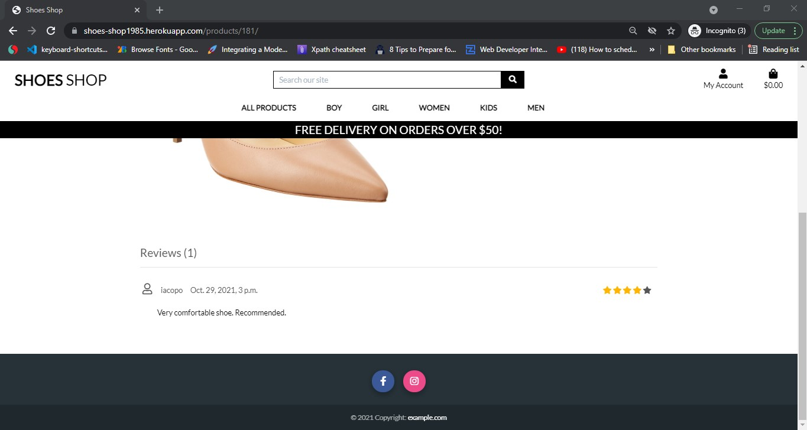
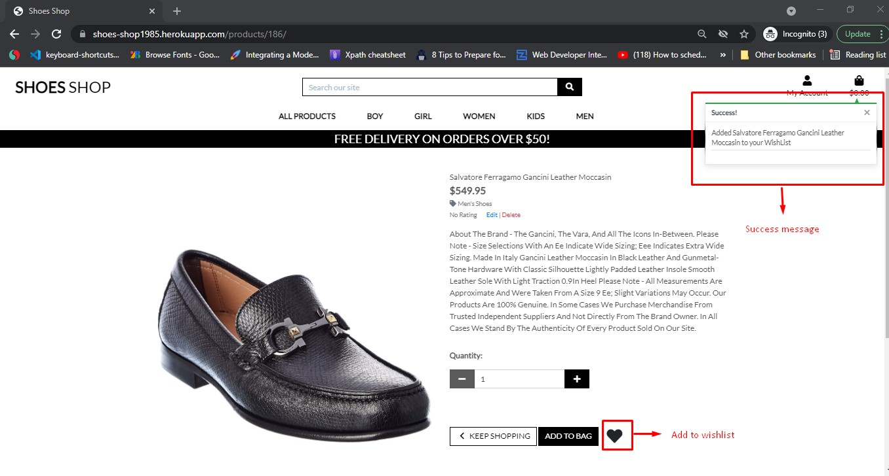
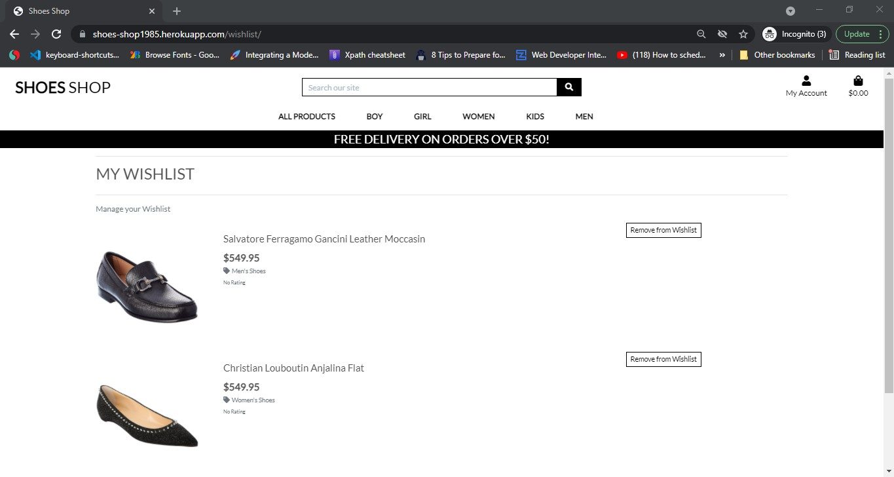
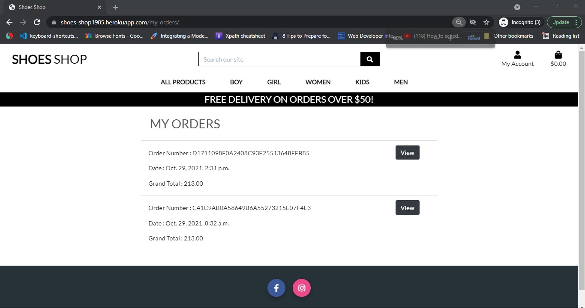
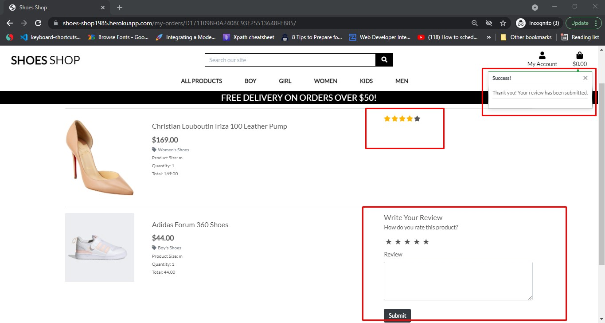

# SHOES SHOP
> This project is an e-commerce website created to advert and sell shoes but only for learning purposes at the moment, so no commercial or business benefits are taken, in future with some changes this project could become potentially a real E-commerce website, implementing a real stripe Api for payments for example.(The Stripe functionality for payment implemented is in testing mode but it has the same functionality). 
The user can easily register and use the platform to buy shoes (using testing mode), create his own favourite wish list and give also a feedback to the seller after registration using the review and rating product form. 
The user receive also a confirmation email after registering for the first time, and after submitting any order request, this functionality is working using the Gmail email account settings, generatig a password for the app. 
The project has been develop in Gitpod and deployed in Heroku using also the S3 AWS Amazon free service to store the photos in a bucket for better performance and user experience. 

## Table of Contents
* [Technologies](#technologies)
* [Others](#others)
* [Deployment](#deployment)
* [Features](#features)
* [Database](#database)
* [Scope](#scope)
* [Credits](#credits)
* [Features](#features)
* [Testing](#testing)
* [Acknowledgments](#Acknowledgments)

### User Stories

* The user can choose from 5 different categories of shoes: Men, Women, Kids, boy, girl and can easily buy any item available using the stripe payment gateway system in testing mode so not real payments. 
* I did not complete fully still all the categoties with the relevant items, for example the girl category still does not have any shoes available but I am planning to add more soon  
* The user can create his own favourite item list using the Wishlist model created 
* The user can also review and give a rating score for any product bought, please see below for better explanation of user stories. 
* The project is designed to be compatible with all devices, from computer to mobile and Highpads. 


## Technologies
### Languages
* [HTML5](#https://en.wikipedia.org/wiki/HTML5)
* [CSS3](#https://en.wikipedia.org/wiki/CSS)
* [JavaScript](#https://en.wikipedia.org/wiki/JavaScript)
* [Python3](#https://www.python.org/)
* [Balsamiq Wireframes] used for the project draft 
* [Python] validator (#http://pep8online.com/) very helpful to chech the identation
* [CSS3] validator (#https://jigsaw.w3.org/css-validator/)
* [Javascript] validator (#https://jshint.com/)
* [w3schools] was used as a general source of knowledge
* [Google Chrome Developer Tool] this built-in developer tool was used to inspect page elements and help debug issues
* [Stackoverflow] was used as a general source of knowledge (#https://stackoverflow.com/)
* [Json Formatter] was used as json file formatter and validator


### Frameworks and Libraries
* [Django](#https://www.djangoproject.com/)
* [Pip3](#https://pip.pypa.io/en/stable/)
* [jQuery](#https://jquery.com/)
* [FontAwesome](#https://fontawesome.com/)
* [Bootstrap](#https://getbootstrap.com/)

## Deployment 
* [Heroku](#https://id.heroku.com/login) used to deploy live site. The live app is (#https://shoes-shop1985.herokuapp.com/)
* [GitHub](#https://github.com/) used to host repository. The project repository ling is (#https://github.com/Iacopo454/Shoes-shop/)

## Others
* [Stripe](#https://stripe.com/en-ie) used for the payments system, this software offers payment processing software and application programming interfaces for e-commerce websites and mobile applications
* [AWS](#https://aws.amazon.com/) used for file storage.
* [GitPod](#https://www.gitpod.io/) used to develop project and organise version control.

## Scope
* Clean User Experience by using technologies mentioned in the introduction - HTML, CSS, JavaScript, Python + Django, Stripe, Heroku
* Easy and intuitive navigation via the navbar with dropdown categories of products 
* Interactive features for the users: buy button, wishlist, review, bag, account with profile, checkout and information about each product, like description, rating, price, image
* Wishlist for creating favorite products list in and the possibility to give review for a product bought 
* Secure log out feature to store data safely registering, sign in and loggin out
* Footer with social media icons to link to Facebook, Instagram and Twitter


## Credits
* Photos:
All taken from https://shoppremiumoutlets.com/ (as mention the website it is not used for commectical purposes but only learning and educational)
* Code: 
Code inspiration for the whole project and code snippets for the fundamental base structure borrowed from "Boutique Ado" the walkthrough project of Code Institute for the MS4 
* Code inspiration for Wishlist and Review model adapted after mentor sessions with my mentor Sandeep Aggarwal following similar implementation of the video-lesson in CI for creating models

* Website type and purpose:
The website is an E-commerce website for learning purposes only at the moment and following the requirements of the MS4 provided from Code institue.

## Features
### Wishlist page
One logged-in user can save his favourite products on his wishlist page.
On the wishlist page, the user can view:
- List of products of his favorite.
- By click remove button, one can remove the product from his wishlist.

#### How create a wishlist app
For wishlist functionality, I create a separate `Wishlist` app. By `python3 manage.py startapp wishlist` is a script that will create the directories and files for wishlist. The directory structure which looks like this:

```
wishlist/
    __init__.py
    admin.py
    apps.py
    migrations/
        __init__.py
    models.py
    tests.py
    views.py
```
In the `settings.py` file, I need to add a refference of wishlist app in the `INSTALLED_APPS` settings.

```
INSTALLED_APPS = [
    ....,
    ....,
    'wishlist',
]
```

In the wishlist app, I have create a model: `UserWishlist` has a user, product, created_at fields. The user is associated with auth user model and the product is associated with product model.

wishlist/models.py
```
from django.db import models
from django.contrib.auth.models import User
from products.models import Product


class UserWishlist(models.Model):
    """
    A user wishlist model for storing user product wishlist
    """
    user = models.ForeignKey(User, on_delete=models.CASCADE)
    product = models.ForeignKey(Product, on_delete=models.CASCADE, related_name='wishlist_product')
    created_at = models.DateTimeField(auto_now_add=True)

    def __str__(self):
        return f"{self.user} - {self.product}"
```
In the `UserWishlist` model:
- `user` field that using `ForeignKey`. That tells Django the user field is related with auth user model.
- `product` field that also using `ForeignKey`. That tells Django the product field is related with Product model.
- `created_at` field datatype is `DateTImeField` for storing datetimes into the database. By `auto_now_add=True`, automatically set time when an user create a wishlist.

For creating migrations file in `wishlist/migrations`, I run another command:
```
python3 manage.py makemigrations wishlist
```

Now, run migrate again to create the userwishlist model tables in the database: 
```
python3 manage.py migrate
```

In `products/templates/products/product_details.html` file, I have added a icon for add wishlist for specific product.
```
<a href="" class="btn btn-lg mt-5 wishlist_btn" style="font-size: 2rem">
    <span class="icon">
        <i class="fas fa-heart"></i>
    </span>
</a>
```
When click on the icon, its call the `add_to_wishlist` function with product id parameter.
For urls, I have created `urls.py` file in wishlist app and added these new views:
```
from django.urls import path
from . import views

app_name = 'wishlist'

urlpatterns = [
    path('<int:product_id>/', views.add_to_wishlist, name='add_to_wishlist'),
]
```

In `wishlist/views.py`:
```
@login_required
def add_to_wishlist(request, product_id):
    """A view to add or remove from wishlist"""
       
    product = get_object_or_404(Product, id=product_id) 
    user_wishlist = product.wishlist_product.filter(user=request.user) 

    if user_wishlist.exists():
        user_wishlist.delete()
        msg = f"{product} has been removed from your WishList"
        messages.error(request, msg)
    else:        
        wishlist = UserWishlist(user=request.user, product=product)
        wishlist.save()  
        msg = f"Added {product} to your WishList"      
        messages.success(request, msg)

    return HttpResponseRedirect(request.META["HTTP_REFERER"])
```
In the views, the `@login_required` decorators indicates that only authenticated use can access the function. In this function, `get_object_or_404` checks the prodcut for the passes product_id exists or not in product table. If it exists in product table, then again checks in the userwishlist table that for the requsted user the product exists or not.
If in userwishlist the product id exists, then delete the row from table and pass a error message.
Otherwise, the product_id and requested user_id save into the UserWishlist model table and pass a success message.

By `HttpResponseRedirect` the function redirect to the `HTTP_REFERER` indicates value.

In `products/templates/products/product_details.html` file, I have added a condition that if the product already exists in the wishlist, it'll show the `<i class="fas fa-heart"></i>` icon, otherwise it'll show `<i class="far fa-heart"></i>`. The codes are lool like:
```
<a href="" class="btn btn-lg mt-5 wishlist_btn" style="font-size: 2rem">
    <span class="icon">
        
        <i class="fas fa-heart"></i>
        
        <i class="far fa-heart"></i>
        
    </span>
</a>
```
And in the `products/views.py`, I added some codes for checking product has in wishlist or not when shows the specific product details page and pass the value with context.
The `product_detail()` function, the extended codes are:
```
def product_detail(request, product_id):
    """ A view to show individual product details """

    product = get_object_or_404(Product, pk=product_id)

    # check the product for the requested user wishlist exists or not
    wishlist = False
    if request.user.is_authenticated:
        user_wishlist = product.wishlist_product.filter(user=request.user)
        if user_wishlist.exists():
            wishlist = True

    context = {
        'product': product,
        'categories': Category.objects.all(),
        'wishlist': wishlist,
    }

    return render(request, 'products/product_detail.html', context)
```

#### My Wishlist page
In the `templates/base.html`, I have added a menu "My wishlist" in the `Accounts` drowdown. The menu is responsible for showing the list of specific user favourite products. The extened codes are:
```
<a href="" class="dropdown-item">My Wishlist</a>
```

In `shoes_shop/urls.py`, I need to include the `wishlist` app urls.
```
urlpatterns = [
    path("admin/", admin.site.urls),
    path("accounts/", include("allauth.urls")),
    path("", include("home.urls")),
    path("products/", include("products.urls")),
    path("wishlist/", include("wishlist.urls")),
    path("bag/", include("bag.urls")),
    path("checkout/", include("checkout.urls")),
    path("profile/", include("profiles.urls")),
] + static(settings.MEDIA_URL, document_root=settings.MEDIA_ROOT)
```

When user click on the menu, the wishlist index path() are call the views for showing list.
In wishlist/urls.py, I added another path:
```
urlpatterns = [
    path('', views.wishlist_view, name='index'),
    path('<int:product_id>/', views.add_to_wishlist, name='add_to_wishlist'),
]
```

In wishlist/views.py, the wishlist_view function has been added:
```
@login_required
def wishlist_view(request):
    """Show all product of wishlist for the requested user"""

    user_wishlist = UserWishlist.objects.filter(user=request.user)
    return render(request, "wishlist/user_wishlist.html", {
        "user_wishlist": user_wishlist, 
        "categories": Category.objects.all()
        })
```
In this code, `@login_required` indicates that only authenticated user can access the function.
For the request user, get all objects from `UserWishlist` model tables and pass with render function.
`Category.objects.all()` that gets all catgories from catgory tables for showing into the navbar.
The render function return into a template `wishlist/user_wishlist.html`.

In `wishlist/temlates/wishlist/user_wishlist.html`, if get the wishlist, it'll show the objects data by looping, otherwise it'll show `No products have been added to your wishlist yet`.
In this page, by clicking `Remove from Wishlist` button, user can delete the product for his wishlist.
The `user_wishlist.html` some parts code are given below:
```
 <div class="row">
    <div class="col-12">
        <p class="text-muted">Manage your Wishlist</p>
        
            
            <div class="row">
                <div class="col-md-2">
                    
                        <a href="">
                            
                        </a>
                        
                        <a href="">
                            
                        </a>
                    
                </div>
                <div class="col-md-7">
                    <div class="card-body">
                        <h5 class="card-title">{{product.product}}</h5>
                        <p class="lead mb-0 text-left font-weight-bold">${{ product.product.price }}</p>
                        
                        <p class="small mt-1 mb-0">
                            <a class="text-muted" href="?category={{ product.product.category.name }}">
                                <i class="fas fa-tag mr-1"></i>{{ product.product.category.friendly_name }}
                            </a>
                        </p>
                        
                        <p class="small mt-1 mb-0">
                        
                            <small class="text-muted"><i class="fas fa-star mr-1"></i>{{ product.product.rating }} / 5</small>
                        
                            <small class="text-muted">No Rating</small>
                        
                        </p>
                    </div>
                </div>
                <div class="col-md-3">
                    <a type="button" class="btn btn-outline-black rounded-0 fw500 btn-sm custom-btn" href="">Remove from Wishlist</a>
                </div>
            </div>                
            
        
        <p class="card-text">No products have been added to your wishlist yet</p>
        
    </div>
</div>
```

For showing the wishlist model into the Django Administrator panel, need to register the userwishlist model in the admin file.
In `wishlist/admin.py`, the codes looks like:
```
from django.contrib import admin
from wishlist.models import UserWishlist

admin.site.register(UserWishlist)
```


### Orders page
On the orders page, the user can view the list of all his own orders.

### Order details page
On the order details page, the user can view:
- List all his purchased products for a specific order.
- Review form for feedback.

### Review
One user can give feedback and rate for a product of his purchased product.
The rating and feedback will be shown on the product details page.

#### How create a review app
For order details and review functionality, I create a separate `Review` app. By `python3 manage.py startapp Review` is a script that will create the directories and files for review. The directory structure which looks like this:

```
review/
    __init__.py
    admin.py
    apps.py
    migrations/
        __init__.py
    models.py
    tests.py
    views.py
```
In the `settings.py` file, I need to add a refference of wishlist app in the `INSTALLED_APPS` settings.

```
INSTALLED_APPS = [
    ....,
    ....,
    'review',
]
```

+ *Note: As one can review and rate a product after purchusing the product. So, for implement the review section, I create another additional two pages. These are `My Orders` and `Orders details`*

In `shoes_shop/urls.py`, I need to include the `review` app urls.
```
urlpatterns = [
    path("admin/", admin.site.urls),
    path("accounts/", include("allauth.urls")),
    path("", include("home.urls")),
    path("products/", include("products.urls")),
    path("wishlist/", include("wishlist.urls")),
    path("bag/", include("bag.urls")),
    path("checkout/", include("checkout.urls")),
    path("profile/", include("profiles.urls")),
    path("my-orders/", include("review.urls")),
] + static(settings.MEDIA_URL, document_root=settings.MEDIA_ROOT)
```

#### My Orders page
In the `templates/base.html`, I have added a new menu "My Orders" in the `Accounts` drowdown. The menu is responsible for showing the list of specific user placed orders. The extened codes are:
```
<a href="" class="dropdown-item">My Orders</a>
```

When user click on the menu, the review index path() are call the views for showing the user all orders list.
I have created a urls.py file in review app and define the index path.
```
from django.urls import path
from . import views

app_name = 'review'

urlpatterns = [
    path('', views.order_view, name='index'),
]
```

In review/views.py, the order_view function has been added:
```
@login_required
def order_view(request):
    """Show all orders for the requested user"""

    orders = Order.objects.filter(user_profile__user=request.user).order_by('-id')
    return render(request, "review/order_list.html", {"orders": orders, 'categories': Category.objects.all()})
```
In this code, `@login_required` indicates that only authenticated user can access the function.
For the request user, get all objects from `Order` model tables and pass with render function.
`Category.objects.all()` that gets all catgories from catgory tables for showing into the navbar.
The render function return into a template `review/order_list.html`.

In `review/temlates/review/order_list.html`, if get the any orders, it'll show the objects data by looping, otherwise it'll show `No order yet`.
In this page, by clicking `View` button, user can view the order details page for the specific order.
The `order_list.html` some parts code are given below:
```
<div class="row">
    <div class="col-12 col-lg-8 offset-lg-2">
        
            <table class="table">
                
                <tr>
                    <td>
                        <div class="d-flex flex-column">
                            <div class="p-2">Order Number : {{order.order_number}}</div>
                            <div class="p-2">Date : {{order.date}}</div>
                            <div class="p-2">Grand Total : {{order.grand_total}}</div>
                        </div>
                    </td>
                    <td>
                        <a href="" class="btn btn-dark">View</a>
                    </td>
                </tr>
                
            </table>
        
        <p class="card-text">No order yet</p>
        
    </div>
</div>
```
In this page, in the order list shows the order number, date and grand total by {{order.order_number}}, {{order.date}} and {{order.grand_total}}.

For `order details`, added another url in the `review/urls.py`
```
urlpatterns = [
    path('', views.order_view, name='index'),
    path('<str:order_number>/', views.order_details, name='order_details'),
]
```

For getting order details, need to pass the order_number with the url, then the url calls the order_details().
The order details view looks like:
```
@login_required
def order_details(request, order_number):
    """A view to show the details of a specific order"""

    order_item = OrderLineItem.objects.filter(order__order_number=order_number, order__user_profile__user=request.user)
    return render(request, "review/order_details.html", {"order_item": order_item, 'categories': Category.objects.all()})
``` 
In the view, get data that filter by order_number and requested user from the `OrderLineItem` model table.
And return the order item with all catgories and render into a template.

For rendering data, I have created a html file in `review/templates/review/` directory with named `order_details.html`.

In html template, the items show by for loop and display product image, product name, product catgory(If has any category), product size(If has any size), quantity, and total amount for each product.


### How review works

In the review app, I have create a model: `ReviewRating` has order_item, rating, review, created_at fields. The order_item is associated with checkout app's OrderLineItem model.

wishlist/models.py
```
from django.db import models
from django.contrib.auth.models import User
from products.models import Product
from checkout.models import OrderLineItem


class ReviewRating(models.Model):
    """
    A user review rating model
    """ 
    order_item = models.ForeignKey(OrderLineItem, on_delete=models.CASCADE, related_name='review_order_item')
    rating = models.IntegerField()
    review = models.TextField()
    created_at = models.DateTimeField(auto_now_add=True)

    def __str__(self):
        return f'{self.order_item} - {self.rating}'
```
In the `ReviewRating` model:
- `order_item` field that using `ForeignKey`. That tells Django the user field is related with OrderLineItem model. Because one can give feedback for each order item.
- `rating` field that using `IntegerField`.
- `review` field that using `TextField`.
- `created_at` field datatype is `DateTImeField` for storing datetimes into the database. By `auto_now_add=True`, automatically set time when an user create a wishlist.

For creating migrations file in `review/migrations`, I run another command:
```
python3 manage.py makemigrations review
```

Now, run migrate again to create the ReviewRating model tables in the database: 
```
python3 manage.py migrate
```

### Reveiw Form
For rendering review form, I have created `forms.py` in the review app.
In the form class I have used `ModelForm`. In Meta, `ReviewRating` is the model name and fields of the model are taken in a list.
`review/forms.py` looks like:
```
from django import forms
from .models import ReviewRating

class ReviewForm(forms.ModelForm):
    class Meta:
        model = ReviewRating
        fields = ['order_item', 'rating', 'review']
```

### Review Form Render
The review form show in the orders details page for each product. In the `order_details.html` I include the review form by ``.
In `review/templates/review/order_details.html`,
```
 <!-- get the review form -->
 
```
In `review/templates/review/user_review.html`, there are a html form with input fields and textarea fields. When the form submit by user, it uses `POST` method and call `submit_review()` for submitting the form data. The form method and action looks like:
```
<form method="post" action="">
    
```
And for post method, it is required to send `` for submit the form.

In `review/templates/review/order_details.html`, I have include a extra css link for review form radio button styles. The block looks like:
```

    <link rel="stylesheet" href="">

```

In `static/css/review.css`,the rating radio button style change and display these as star. When hover or click on the rating star, the star color change.
Some of css codes are shown below:
```
/* Showing the stars */
.rate > label:before{
    display: inline-block;
    font-size: 1.5rem;
    font-family: FontAwesome;
    content: "\2605";
    margin: 0;
    padding: 0.3rem 0.2rem;
    cursor: pointer;
}

/* click and hover */
input:checked ~ label, label:hover ~ label{
    color: #ffb503;
}

/* hover highlight */
input:checked + label:hover, input:checked ~ lable:hover, input:checked ~ label:hover ~ label, label:hover ~ input:checked ~ label{
    color: #cc9000;
}
```

In `review/urls.py`, I add another url for submit review form. The urls is:
```
path('submit_review/', views.submit_review, name='submit_review'),
```

The url call the submit_review() that located in the `review/views.py`.
When an user submit the review form with rating and review data, the `POST` method request the submit_review function and if the form data are valid then the order_item id, rating for this product, and review save in the `ReviewRating` model table into the database.

At the same time, for the specific product get the avarage rating from the `ReviewRating` model.
The avarage rating data udpate into the product table for the specific product.
Then it returns a success message and redirect the requested header url by `request.META.get('HTTP_REFERER')`. The `submit_review()` is:
```
@login_required
def submit_review(request):
    """A view to submit a review"""

    url = request.META.get('HTTP_REFERER')
    if request.method == 'POST':
        form = ReviewForm(request.POST)
        if form.is_valid():
            data = ReviewRating(
                order_item= form.cleaned_data['order_item'], 
                rating= form.cleaned_data['rating'], 
                review= form.cleaned_data['review']
            )
            data.save()

            # calculate review of the product
            # and save into product model
            avg_rating = ReviewRating.objects.filter(order_item__product=data.order_item.product).annotate(ave_price=Avg('rating'))
            Product.objects.filter(pk=data.order_item.product.id).update(rating=avg_rating[0].rating)

            messages.success(request, 'Thank you! Your review has been submitted.')
            return redirect(url)
```

In the `order_details.html`, if a item already has any the review, then in the template shows the rating instead of the reveiw form. The codes look like:
```


................
................


    
        <span class="fa fa-star review_checked "></span>
        <span class="fa fa-star review_checked "></span>
        <span class="fa fa-star review_checked "></span>
        <span class="fa fa-star review_checked "></span>
        <span class="fa fa-star review_checked "></span>
        
    
        <!-- get the review form -->
        
    

    <!-- get the review form -->
    

```
In the top, `` is responsible for loading a template tag. This template tag located at `review/templatetags/tag_library.py`. The code are:
```
from django import template

register = template.Library()

@register.filter()
def to_int(value):
    return int(value)
```

This is responsible for convert a string to integer. This tag used as `to_int` for review.rating string filter.

### Show all review in the products details page
In `products/templates/products/product_details.html`, include another row for showing the review for the product. In this section, display the total number of review for the product and all feedback with rating. Also, shown in the list who gave the review and when.

For passing the variable with the product details, I have extend the 
product_details function in the `product/views.py`. The extended codes are:
```
# get reviews
reviews = ReviewRating.objects.filter(order_item__product=product)

context = {
    'product': product,
    'categories': Category.objects.all(),
    'wishlist': wishlist,
    'total_review': reviews.count(),
    'reviews': reviews,
}
```

For showing the review rating model into the Django Administrator panel, need to register the ReviewRating model in the admin file.
In `review/admin.py`, the codes looks like:
```
from django.contrib import admin
from review.models import ReviewRating

admin.site.register(ReviewRating)
```

### Tutorials
- https://www.youtube.com/watch?v=YZvRrldjf1Y was used as a general source of knowledge.
- Code institute video lessons on how to build an E-commerce website using Django, Python, Javascript, Html and CSS.

## Database
Two relational databases were used to create this site - during development SQLite was used and then Postgres was used for the production on Heroku. Below is an image of ERD how the database models relate to each other:




## Testing
* The app has been tested on different devices and browser (Google Chrome, Safari, Mozilla and Internet Explorer) and it has not shown anymore issues or errors in the functionalities implemented. The devices used for testing are the following: 
a Macbook Air, an Highpone 8 and a Window computer. 
* Testcase testing has been used for all the models: Products, Checkout, Wishlist and Review to make sure are working properly. 

### Testing from user stories
#### As an unregistered, I want to 

  + *be able to browse through all products available.*

All users, regardless of registered/logged in status, can browse through all products, add to bag and make a purchase:



---

  + *have the ability browse through the categories on the site.*

All users, regardless of registered/logged in status, can browse through the listed categories:



---

  + *have the ability to show details of a specific product on the site.*

All users, regardless of registered/logged in status, can see the products details: 


---

  + *have the ability to see the reviews of a product details page.*

All users, regardless of registered/logged in status, can see the reviews of a specific product: 



---


#### As an registered user, I want to 

  + *be able to create wishlist of my favourite products.*

An authenticated user, can add their favourite products in their wishlist:



---

  + *have the ability browse through the 'My Wishlist' menu on the site.*

An authenticated user, can see his wishlists products:



---

  + *have the ability browse through the 'My Orders' menu on the site.*

An authenticated user, can see his all orders:



---

+ *have the ability to see specific orders details with purchased products through click on view button.*

An user, able to give feedback and rate the products from this page.



---

### Automated Testing
Automated Unit Testing was carried out with Django testing tools and written to cover as much of the site as possible.
In terminal, for automated testing need to run the command:
    `python3 manage.py test`

For testing models, I have used fixtures for dummy data insert into the database.
I have created some fixures, so that can easily use these data.
- In `products/fixtures/categories.json`
```
[{
    "pk": 1,
    "model": "products.category",
    "fields": {
        "name": "Girl",
        "friendly_name": "Girls shoes"
    }
}]
```
- In `products/fixtures/products.json`
```
[{
    "pk": 1,
    "model": "products.product",
    "fields": {
        "sku": "DFG465646",
        "name": "Jimmy Choo Minette Glitter Flat",
        "description": "Minette Glitter Flat In Goldie Coarse Glitter Fabric And Silver - Tone",
        "price": 449.95,
        "category": 4,
        "image": " b60774d120794feda3d53922caf54dcf_1800x1800.jpg"
    }
}]
```
- In `checkout/fixtures/orders.json`
```
[{
    "pk": 1,
    "model": "checkout.order",
    "fields": {
        "order_number": "DFG465646",
        "full_name": "Jimmy",
        "email": "jimmy@gmail.com",
        "grand_total": 449.95,
        "date": "2021-09-02 17:31:40.701665"
    }
},{
    "pk": 1,
    "model": "checkout.OrderLineItem",
    "fields": {
        "order": "1",
        "product": "1",
        "quantity": "2",
        "lineitem_total": "1"
    }
}
]
```
- In `checkout/fixtures/users.json`
```
[{
    "pk": 1,
    "model": "auth.user",
    "fields": {"email": "test@gmail.com", 
        "first_name": "user_first_name", 
        "last_name": "user_last_name", 
        "password": "test123456"
    }
}]
```

+ *Note: Destroying test database for alias 'default'*


#### Wishlist App
- Models
  - test for storing wishlist products into the database

For the testcase, I have created `test_models.py` in the `wishlist/tests` directory. The testcase codes is shown below:
```
from django.test import TestCase
from wishlist.models import UserWishlist

class UserWishlistModelTest(TestCase):
    """ Unit test for UserWishlist model. """

    fixtures = ['categories.json', 'products.json', 'users.json', ]

    def setUp(self):
        UserWishlist.objects.create(
            user_id=1, product_id=1
        )

    def test_create_wishlist(self):
        """Favourite product that can saved into database"""

        wishlist = UserWishlist.objects.get(user_id=1)
        self.assertEqual(wishlist.product_id, 1)
```

In the unittest case, I used the fixtures for loading demo data. In the setUp(), create a wishlist then in then test_create_wishlist() checks that the user wishlist successfully save into the database or not.


- Views
  - test that unauthorized users cannot see the wishlist page.
  - test that unauthorized users cannot add product in wishlist.
  - test a logged in user can see the wishlist page.
  - test for authenticated user can add product in wishlist and agian redirect to the product details page.

For views file testing, I have create `test_views.py` in the `wishlist/tests` directory.


#### Review App
- Models
  - test for storing data for a review into the database

For the testcase, I have created `test_models.py` in the `review/tests` directory. The testcase codes is shown below:
```
from django.test import TestCase
from review.models import ReviewRating

class ReviewRatingModelTest(TestCase):
    """ Unit test for review rating model. """

    fixtures = ['categories.json', 'products.json', 'orders.json', ]

    def setUp(self):
        ReviewRating.objects.create(
            order_item_id=1, rating=5, review="Good product"
        )

    def test_create_review(self):
        """Review that can saved into database"""

        review = ReviewRating.objects.get(order_item=1)
        self.assertEqual(review.rating, 5)
        self.assertEqual(review.review, 'Good product')
```

In the unittest case, I used the fixtures for loading demo data. In the setUp(), create a ReviewRating objects then in then test_create_review() checks that the review successfully save into the database or not.

- Views
  - test that unauthorized users cannot see the orders list page.
  - test that unauthorized users cannot view specific order details.
  - test that unauthorized users cannot give any feedback. 
  - test a logged in user can see the orders list page.
  - test for authenticated user can view a specific order details.
  - test for authenticated user can give feedback and rate the purchese product. Then redirect at order details page.

For views file testing, I have create `test_views.py` in the `review/tests` directory.

- Forms
  - test that specific fields are required. Otherwise an invalid form retun False
  - test that a valid form return True

For views file testing, I have create `test_forms.py` in the `review/tests` directory. The review form testcase codes are:
```
class ReviewFormTest(TestCase):
    """ Unit test for review form. """

    fixtures = ['categories.json', 'products.json', 'orders.json', ]

    def test_review_form_is_invalid(self):
        form = ReviewForm(data={"order_item": "1", "rating": "5"})
        self.assertFalse(form.is_valid())

    def test_review_form_is_valid(self):
        form = ReviewForm(data={"order_item": "1", "rating": "5", "review": "Good product"})
        self.assertTrue(form.is_valid())
```


#### To clone the code from GitHub:
- On GitHub, navigate to the main page of the repository.
- Above the list of files, click Code:
- To clone the repository using HTTPS, click HTTPS under "Clone".
- Open Git Bash.
- Change the current working directory to the location where you want the cloned directory.
- Type git clone, and then paste the URL you copied earlier: $ git clone
* https://github.com/Iacopo454/Shoes-shop
- Press Enter to create your local clone.
- Create your own env.py file to store variables, and ensure this is listed in your .gitignore file to keep these from being displayed publicly

## To Deploy the project in Heroku:
* Create your account on Heroku here: https://signup.heroku.com/login
* Create a new app on heroku:
Go to: https://dashboard.heroku.com/apps select new, create new app from the dropdown menu on the right. Enter your app-name and region and click create app. Under deployment method, select github to activate automatic deployments from Git to Heroku. 

### Slack Community

* I resolved many issues encountered after searching on Slack in the Code Institute community.
* I managed to solve error using Google and checking with the Tutor support team of Code Institute 

## Acknowledgments
I would like to thank the tutor from Code Institute which tutor me and help me throught this project difficulties, my mentor "Sandeep Aggraval" which has been patient and the Slack commumnity which not only provide helps with active users but it is often helpful with answer to previous frequent questions from anyone part of this community.   